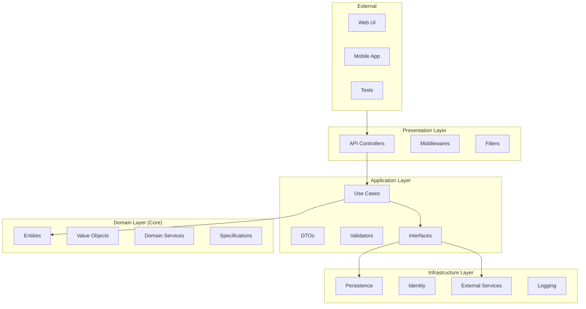
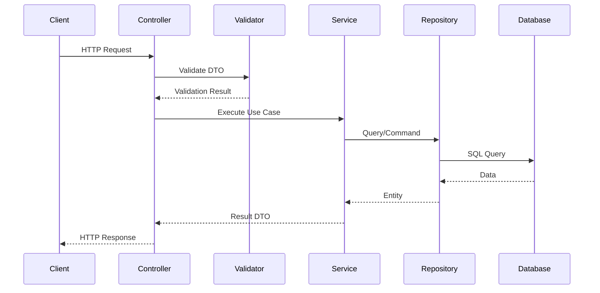
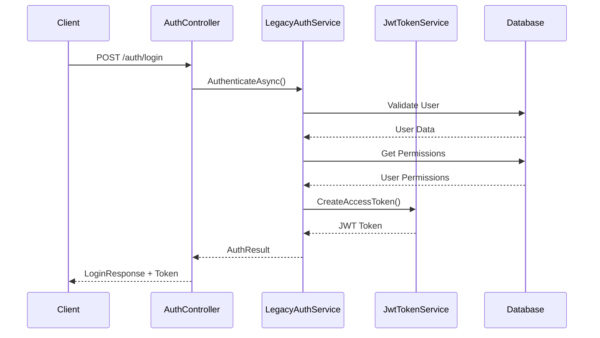

# 🏗️ Arquitetura - RhSensoERP API

## 📋 Índice

- [Visão Geral](#visão-geral)
- [Clean Architecture](#clean-architecture)
- [Estrutura de Pastas](#estrutura-de-pastas)
- [Fluxo de Dados](#fluxo-de-dados)
- [Componentes Principais](#componentes-principais)
- [Padrões Utilizados](#padrões-utilizados)
- [Decisões Arquiteturais](#decisões-arquiteturais)

## 🎯 Visão Geral

A **RhSensoERP API** foi desenvolvida seguindo os princípios da **Clean Architecture**, garantindo:

- ✅ **Separação clara de responsabilidades**
- ✅ **Baixo acoplamento** entre camadas
- ✅ **Alta coesão** dentro das camadas
- ✅ **Testabilidade** e **manutenibilidade**
- ✅ **Independência de frameworks** e tecnologias

## 🏛️ Clean Architecture

### **Diagrama de Camadas**



### **Fluxo de Dependências**

```
┌─────────────────────────────────────────────────────────────┐
│                    DEPENDENCY RULE                         │
│  Source code dependencies can only point INWARDS          │
└─────────────────────────────────────────────────────────────┘

Presentation ──→ Application ──→ Domain (Core)
     ↓                ↓              ↑
Infrastructure ──────────────────────┘
     ↑
(implements interfaces defined in Application)
```

## 📁 Estrutura de Pastas

```
RhSensoERP/
├── Src/
│   ├── API/                           # 🌐 Presentation Layer
│   │   ├── Controllers/               # Controllers REST
│   │   ├── Middlewares/               # Middlewares customizados
│   │   ├── Configuration/             # Configurações de serviços
│   │   └── Program.cs                 # Entry point
│   │
│   ├── Application/                   # 📋 Application Layer
│   │   ├── Security/                  # Casos de uso de segurança
│   │   │   ├── Auth/                  # Autenticação
│   │   │   │   ├── DTOs/              # Data Transfer Objects
│   │   │   │   ├── Services/          # Interfaces de serviços
│   │   │   │   └── Validators/        # Validadores FluentValidation
│   │   │   └── Users/                 # Gestão de usuários
│   │   ├── Common/                    # Componentes comuns
│   │   │   ├── Behaviors/             # MediatR behaviors
│   │   │   ├── Interfaces/            # Interfaces da aplicação
│   │   │   └── Mappings/              # AutoMapper profiles
│   │   └── Auth/                      # Autorização
│   │
│   ├── Infrastructure/                # 🔧 Infrastructure Layer
│   │   ├── Persistence/               # Acesso a dados
│   │   │   ├── Configurations/        # EF Core configurations
│   │   │   ├── Interceptors/          # EF Core interceptors
│   │   │   └── AppDbContext.cs        # DbContext principal
│   │   ├── Auth/                      # Implementações de auth
│   │   ├── Services/                  # Implementações de serviços
│   │   └── Repositories/              # Implementações de repositórios
│   │
│   ├── Core/                          # 🎯 Domain Layer
│   │   ├── Abstractions/              # Abstrações base
│   │   │   ├── Entities/              # Entidades base
│   │   │   ├── Interfaces/            # Interfaces do domínio
│   │   │   └── Paging/                # Paginação
│   │   ├── Security/                  # Domínio de segurança
│   │   │   ├── Entities/              # Entidades de negócio
│   │   │   └── Permissions/           # Constantes de permissões
│   │   └── Shared/                    # Componentes compartilhados
│   │
│   └── Modules/                       # 📦 Módulos de negócio
│       └── SEG/                       # Módulo de Segurança
│
├── Tests/                             # 🧪 Testes
│   └── RhSensoERP.Tests.Unit/         # Testes unitários
│
└── docs/                              # 📚 Documentação
```

## 🔄 Fluxo de Dados

### **1. Fluxo de Requisição Típico**



### **2. Fluxo de Autenticação**



## 🧩 Componentes Principais

### **1. API Layer (Presentation)**

#### **Controllers**
```csharp
[ApiController]
[Route("api/v1/[controller]")]
[Authorize] // Requer autenticação por padrão
public class BaseController : ControllerBase
{
    // Funcionalidades comuns
}
```

#### **Middlewares**
- **ExceptionHandlingMiddleware**: Captura e padroniza erros
- **SecurityHeadersMiddleware**: Headers de segurança
- **Rate Limiting**: Proteção contra abuso

### **2. Application Layer**

#### **Use Cases / Services**
```csharp
public interface ILegacyAuthService
{
    Task<AuthResult> AuthenticateAsync(string usuario, string senha, CancellationToken ct);
    Task<UserPermissions> GetUserPermissionsAsync(string usuario, CancellationToken ct);
    bool CheckHabilitacao(string sistema, string funcao, UserPermissions permissions);
}
```

#### **DTOs (Data Transfer Objects)**
```csharp
public record LoginRequestDto(string CdUsuario, string Senha);
public record LoginResponseDto(string AccessToken, UserSessionData UserData, 
    List<UserGroup> Groups, List<UserPermission> Permissions);
```

#### **Validators**
```csharp
public class LoginRequestValidator : AbstractValidator<LoginRequestDto>
{
    public LoginRequestValidator()
    {
        RuleFor(x => x.CdUsuario).NotEmpty().Length(1, 30);
        RuleFor(x => x.Senha).NotEmpty().MinimumLength(4);
    }
}
```

### **3. Infrastructure Layer**

#### **Entity Framework Configurations**
```csharp
public class UserConfig : IEntityTypeConfiguration<User>
{
    public void Configure(EntityTypeBuilder<User> builder)
    {
        builder.ToTable("tuse1", schema: "dbo");
        builder.HasKey(x => x.CdUsuario);
        // Mapeamento para sistema legacy
    }
}
```

#### **Repository Pattern**
```csharp
public class EfRepository<T> : IRepository<T> where T : BaseEntity
{
    private readonly AppDbContext _context;
    
    public async Task<T?> GetByIdAsync(Guid id, CancellationToken ct = default)
        => await _context.Set<T>().FindAsync(id, ct);
}
```

### **4. Core/Domain Layer**

#### **Entidades**
```csharp
public class User : AuditableEntity
{
    public string CdUsuario { get; set; } = string.Empty;
    public string DcUsuario { get; set; } = string.Empty;
    public char FlAtivo { get; set; } = 'S';
    
    // Propriedades de conveniência
    public string Username => CdUsuario;
    public bool Active => FlAtivo == 'S';
}
```

#### **Interfaces de Domínio**
```csharp
public interface IRepository<T> where T : BaseEntity
{
    Task<T?> GetByIdAsync(Guid id, CancellationToken ct = default);
    Task AddAsync(T entity, CancellationToken ct = default);
    Task UpdateAsync(T entity, CancellationToken ct = default);
}
```

## 🎨 Padrões Utilizados

### **1. Repository Pattern**
- **Propósito**: Abstração do acesso a dados
- **Implementação**: `IRepository<T>` + `EfRepository<T>`
- **Benefício**: Testabilidade e substituição de tecnologias

### **2. Unit of Work**
- **Propósito**: Controle transacional
- **Implementação**: `IUnitOfWork` + `UnitOfWork`
- **Benefício**: Consistência de dados

### **3. CQRS (Command Query Responsibility Segregation)**
- **Propósito**: Separação entre leitura e escrita
- **Implementação**: DTOs específicos para cada operação
- **Benefício**: Performance e clareza

### **4. Specification Pattern**
- **Propósito**: Consultas complexas reutilizáveis
- **Implementação**: Extension methods (ex: `Users.Ativos()`)
- **Benefício**: Reutilização e expressividade

### **5. Options Pattern**
- **Propósito**: Configuração tipada
- **Implementação**: `JwtOptions`, `CorsOptions`
- **Benefício**: Type safety e validação

## 🔧 Decisões Arquiteturais

### **1. Integração com Sistema Legacy**

**Decisão**: Mapear diretamente para tabelas existentes sem migrations
```csharp
// UserConfig.cs - Mapeamento direto para tuse1
builder.ToTable("tuse1", schema: "dbo");
builder.HasKey(x => x.CdUsuario); // PK existente
builder.Ignore(x => x.Id); // Propriedade não existe na tabela
```

**Justificativa**:
- ✅ Não altera estrutura existente
- ✅ Compatibilidade com sistema atual
- ❌ Limitações na evolução do modelo

### **2. JWT com Suporte Duplo (HMAC/RSA)**

**Decisão**: Chaves simétricas para dev, RSA para produção
```csharp
// AuthExtensions.cs
if (string.IsNullOrEmpty(jwt.PublicKeyPem))
    key = new SymmetricSecurityKey(Encoding.UTF8.GetBytes(secretKey));
else
    key = new RsaSecurityKey(rsa);
```

**Justificativa**:
- ✅ Desenvolvimento simplificado
- ✅ Produção mais segura
- ✅ Flexibilidade de deployment

### **3. Clean Architecture Adaptada**

**Decisão**: Core contém apenas abstrações, domínio rico nas entidades
```csharp
// User.cs - Propriedades de conveniência
public string Username => CdUsuario;
public bool Active => FlAtivo == 'S';
```

**Justificativa**:
- ✅ Domínio expressivo
- ✅ Compatibilidade com legacy
- ✅ Evolução gradual

### **4. Sistema de Permissões Granulares**

**Decisão**: Verificação baseada em sistema + função + ação
```csharp
bool CheckBotao(string sistema, string funcao, char acao, UserPermissions permissions)
```

**Justificativa**:
- ✅ Controle fino de acesso
- ✅ Compatibilidade com modelo legacy
- ✅ Auditoria detalhada

### **5. Rate Limiting Diferenciado**

**Decisão**: Políticas específicas por endpoint
```csharp
// Program.cs
options.AddPolicy("login", httpContext => /* 5 tentativas por 15min */);
// Global: 100 requests por minuto
```

**Justificativa**:
- ✅ Proteção contra ataques
- ✅ Flexibilidade por contexto
- ✅ UX preservada

## 📊 Métricas de Qualidade

### **Acoplamento**
- ✅ **Baixo**: Camadas dependem apenas de abstrações
- ✅ **Direcionado**: Fluxo unidirecional de dependências
- ✅ **Controlado**: Inversão via DI container

### **Coesão**
- ✅ **Alta**: Funcionalidades relacionadas agrupadas
- ✅ **Funcional**: Cada classe tem responsabilidade única
- ✅ **Modular**: Separação clara por domínio

### **Testabilidade**
- ✅ **Unitária**: Mocks de todas as dependências
- ✅ **Integração**: Testes com banco real
- ✅ **E2E**: WebApplicationFactory

## 🚀 Evolução Arquitetural

### **Próximos Passos**

1. **Modularização**
   ```
   Modules/
   ├── SEG/ (Segurança)
   ├── RHU/ (Recursos Humanos)
   ├── FIN/ (Financeiro)
   └── Shared/
   ```

2. **Event Sourcing**
   - Auditoria completa
   - Eventos de domínio
   - CQRS avançado

3. **Microserviços**
   - Separação por bounded context
   - Message bus (RabbitMQ/Azure Service Bus)
   - API Gateway

4. **Performance**
   - Redis Cache
   - Query optimization
   - Background jobs

## 📚 Referências

- **Clean Architecture** - Robert C. Martin
- **Domain-Driven Design** - Eric Evans
- **Enterprise Integration Patterns** - Gregor Hohpe
- **ASP.NET Core Architecture** - Microsoft Docs

---

💡 **Lembre-se**: A arquitetura é evolutiva. Cada decisão deve ser documentada e revisada conforme o projeto cresce.