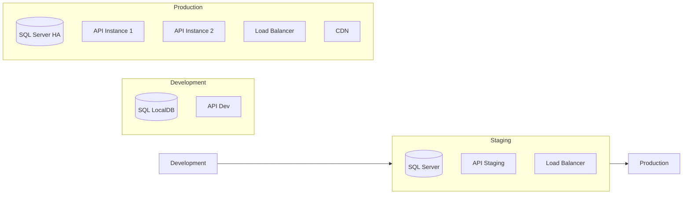

# 🚀 Manual de Deployment - RhSensoERP API

## 📋 Índice

- [Visão Geral](#visão-geral)
- [Ambientes](#ambientes)
- [Docker](#docker)
- [Deployment Manual](#deployment-manual)
- [CI/CD Pipeline](#cicd-pipeline)
- [Monitoramento](#monitoramento)
- [Backup e Recuperação](#backup-e-recuperação)
- [Troubleshooting](#troubleshooting)

## 🎯 Visão Geral

### **Estratégia de Deployment**



### **Checklist de Deployment**

- [ ] ✅ Testes passando (unit + integration)
- [ ] ✅ Configurações validadas
- [ ] ✅ Secrets configurados
- [ ] ✅ Backup do banco
- [ ] ✅ Health checks funcionando
- [ ] ✅ Logs configurados
- [ ] ✅ Rollback plan definido

## 🌍 Ambientes

### **1. Development**
```yaml
Environment: Development
Database: SQL LocalDB / SQL Express
Authentication: Chave simétrica
Logging: Debug level
CORS: Permissivo (*) 
HTTPS: Certificado self-signed
```

### **2. Staging**
```yaml
Environment: Staging
Database: SQL Server dedicado
Authentication: Chaves RSA
Logging: Information level
CORS: Domínios específicos
HTTPS: Certificado válido
Load Balancer: Nginx/IIS
```

### **3. Production**
```yaml
Environment: Production
Database: SQL Server HA (Always On)
Authentication: Chaves RSA + rotação
Logging: Warning/Error only
CORS: Domínios produção apenas
HTTPS: Certificado válido + HSTS
Load Balancer: Azure LB / AWS ALB
CDN: CloudFlare / Azure CDN
```

## 🐳 Docker

### **1. Dockerfile**

```dockerfile
# Dockerfile
FROM mcr.microsoft.com/dotnet/aspnet:8.0 AS base
WORKDIR /app
EXPOSE 8080
EXPOSE 8081

FROM mcr.microsoft.com/dotnet/sdk:8.0 AS build
ARG BUILD_CONFIGURATION=Release
WORKDIR /src

# Copy project files
COPY ["Src/API/RhSensoERP.API.csproj", "Src/API/"]
COPY ["Src/Application/RhSensoERP.Application.csproj", "Src/Application/"]
COPY ["Src/Infrastructure/RhSensoERP.Infrastructure.csproj", "Src/Infrastructure/"]
COPY ["Src/Core/RhSensoERP.Core.csproj", "Src/Core/"]

# Restore dependencies
RUN dotnet restore "Src/API/RhSensoERP.API.csproj"

# Copy source code
COPY . .
WORKDIR "/src/Src/API"

# Build application
RUN dotnet build "RhSensoERP.API.csproj" -c $BUILD_CONFIGURATION -o /app/build

FROM build AS publish
ARG BUILD_CONFIGURATION=Release
RUN dotnet publish "RhSensoERP.API.csproj" -c $BUILD_CONFIGURATION -o /app/publish /p:UseAppHost=false

FROM base AS final
WORKDIR /app
COPY --from=publish /app/publish .

# Create logs directory
RUN mkdir -p /app/logs

ENTRYPOINT ["dotnet", "RhSensoERP.API.dll"]
```

### **2. Docker Compose (Development)**

```yaml
# docker-compose.yml
version: '3.8'

services:
  rhsenso-api:
    build:
      context: .
      dockerfile: Dockerfile
    ports:
      - "5000:8080"
      - "5001:8081"
    environment:
      - ASPNETCORE_ENVIRONMENT=Development
      - ASPNETCORE_URLS=https://+:8081;http://+:8080
      - ASPNETCORE_Kestrel__Certificates__Default__Password=password123
      - ASPNETCORE_Kestrel__Certificates__Default__Path=/app/certs/aspnetapp.pfx
      - ConnectionStrings__Default=Server=sqlserver;Database=bd_rhu_copenor;User Id=sa;Password=YourPassword123;TrustServerCertificate=true;
    volumes:
      - ./certs:/app/certs:ro
      - ./logs:/app/logs
    depends_on:
      - sqlserver
    networks:
      - rhsenso-network

  sqlserver:
    image: mcr.microsoft.com/mssql/server:2022-latest
    environment:
      - ACCEPT_EULA=Y
      - SA_PASSWORD=YourPassword123
      - MSSQL_PID=Express
    ports:
      - "1433:1433"
    volumes:
      - sqldata:/var/opt/mssql
    networks:
      - rhsenso-network

volumes:
  sqldata:

networks:
  rhsenso-network:
    driver: bridge
```

### **3. Docker Compose (Production)**

```yaml
# docker-compose.prod.yml
version: '3.8'

services:
  rhsenso-api:
    image: rhsenso/api:${VERSION:-latest}
    deploy:
      replicas: 2
      restart_policy:
        condition: on-failure
        max_attempts: 3
      resources:
        limits:
          memory: 1G
          cpus: '0.5'
    environment:
      - ASPNETCORE_ENVIRONMENT=Production
      - ASPNETCORE_URLS=https://+:8081;http://+:8080
    secrets:
      - jwt_private_key
      - jwt_public_key
      - db_connection_string
    volumes:
      - logs:/app/logs
    networks:
      - rhsenso-network
      - monitoring

  nginx:
    image: nginx:alpine
    ports:
      - "80:80"
      - "443:443"
    volumes:
      - ./nginx.conf:/etc/nginx/nginx.conf:ro
      - ./certs:/etc/nginx/certs:ro
    depends_on:
      - rhsenso-api
    networks:
      - rhsenso-network

secrets:
  jwt_private_key:
    external: true
  jwt_public_key:
    external: true
  db_connection_string:
    external: true

volumes:
  logs:

networks:
  rhsenso-network:
    driver: bridge
  monitoring:
    external: true
```

### **4. Build e Deploy com Docker**

```bash
# Build da imagem
docker build -t rhsenso/api:latest .

# Tag para registry
docker tag rhsenso/api:latest your-registry.com/rhsenso/api:v1.0.0

# Push para registry
docker push your-registry.com/rhsenso/api:v1.0.0

# Deploy
docker-compose -f docker-compose.prod.yml up -d

# Verificar status
docker-compose ps
docker-compose logs rhsenso-api
```

## 📦 Deployment Manual

### **1. Preparação do Ambiente**

#### **Windows Server / IIS**

```powershell
# 1. Instalar .NET 8 Runtime
# Baixar de: https://dotnet.microsoft.com/download/dotnet/8.0

# 2. Instalar IIS com ASP.NET Core Module
Enable-WindowsOptionalFeature -Online -FeatureName IIS-WebServerRole
Enable-WindowsOptionalFeature -Online -FeatureName IIS-WebServer
Enable-WindowsOptionalFeature -Online -FeatureName IIS-CommonHttpFeatures
Enable-WindowsOptionalFeature -Online -FeatureName IIS-HttpErrors
Enable-WindowsOptionalFeature -Online -FeatureName IIS-HttpLogging
Enable-WindowsOptionalFeature -Online -FeatureName IIS-Security
Enable-WindowsOptionalFeature -Online -FeatureName IIS-RequestFiltering

# 3. Baixar ASP.NET Core Module para IIS
# https://dotnet.microsoft.com/download/dotnet/thank-you/runtime-aspnetcore-8.0.0-windows-hosting-bundle-installer

# 4. Criar diretório da aplicação
New-Item -Path "C:\inetpub\rhsensoerp-api" -ItemType Directory
```

#### **Linux (Ubuntu/Debian)**

```bash
# 1. Instalar .NET 8 Runtime
wget https://packages.microsoft.com/config/ubuntu/22.04/packages-microsoft-prod.deb -O packages-microsoft-prod.deb
sudo dpkg -i packages-microsoft-prod.deb
sudo apt-get update
sudo apt-get install -y aspnetcore-runtime-8.0

# 2. Instalar Nginx
sudo apt-get install -y nginx

# 3. Criar usuário para aplicação
sudo useradd -r -d /var/www/rhsensoerp-api -s /bin/false rhsensoapi

# 4. Criar diretório da aplicação
sudo mkdir -p /var/www/rhsensoerp-api
sudo chown rhsensoapi:rhsensoapi /var/www/rhsensoerp-api
```

### **2. Build e Publicação**

```bash
# 1. Build de produção
dotnet build --configuration Release

# 2. Executar testes
dotnet test --configuration Release --no-build

# 3. Publicar aplicação
dotnet publish Src/API/RhSensoERP.API.csproj \
  --configuration Release \
  --output ./publish \
  --no-build \
  --verbosity normal

# 4. Criar pacote
tar -czf rhsensoerp-api-v1.0.0.tar.gz -C ./publish .
```

### **3. Configuração do Web Server**

#### **Nginx Configuration**

```nginx
# /etc/nginx/sites-available/rhsensoerp-api
upstream rhsensoapi {
    server 127.0.0.1:5000;
    server 127.0.0.1:5001 backup;
}

server {
    listen 80;
    server_name api.rhsenso.com;
    return 301 https://$server_name$request_uri;
}

server {
    listen 443 ssl http2;
    server_name api.rhsenso.com;

    # SSL Configuration
    ssl_certificate /etc/ssl/certs/rhsenso.com.crt;
    ssl_certificate_key /etc/ssl/private/rhsenso.com.key;
    ssl_protocols TLSv1.2 TLSv1.3;
    ssl_ciphers HIGH:!aNULL:!MD5;

    # Security Headers
    add_header X-Frame-Options DENY;
    add_header X-Content-Type-Options nosniff;
    add_header X-XSS-Protection "1; mode=block";
    add_header Strict-Transport-Security "max-age=31536000; includeSubDomains" always;

    # Rate Limiting
    limit_req_zone $binary_remote_addr zone=api:10m rate=10r/s;
    limit_req_zone $binary_remote_addr zone=login:10m rate=5r/m;

    location / {
        limit_req zone=api burst=20 nodelay;
        
        proxy_pass http://rhsensoapi;
        proxy_http_version 1.1;
        proxy_set_header Upgrade $http_upgrade;
        proxy_set_header Connection keep-alive;
        proxy_set_header Host $host;
        proxy_set_header X-Real-IP $remote_addr;
        proxy_set_header X-Forwarded-For $proxy_add_x_forwarded_for;
        proxy_set_header X-Forwarded-Proto $scheme;
        proxy_cache_bypass $http_upgrade;
    }

    location /api/v1/auth/login {
        limit_req zone=login burst=3 nodelay;
        
        proxy_pass http://rhsensoapi;
        proxy_http_version 1.1;
        proxy_set_header Host $host;
        proxy_set_header X-Real-IP $remote_addr;
        proxy_set_header X-Forwarded-For $proxy_add_x_forwarded_for;
        proxy_set_header X-Forwarded-Proto $scheme;
    }

    location /health {
        access_log off;
        proxy_pass http://rhsensoapi;
    }
}
```

### **4. Systemd Service (Linux)**

```ini
# /etc/systemd/system/rhsensoerp-api.service
[Unit]
Description=RhSensoERP API
After=network.target

[Service]
Type=notify
User=rhsensoapi
Group=rhsensoapi
WorkingDirectory=/var/www/rhsensoerp-api
ExecStart=/usr/bin/dotnet /var/www/rhsensoerp-api/RhSensoERP.API.dll
Restart=always
RestartSec=5
KillSignal=SIGINT
SyslogIdentifier=rhsensoerp-api
Environment=ASPNETCORE_ENVIRONMENT=Production
Environment=ASPNETCORE_URLS=http://localhost:5000;http://localhost:5001

[Install]
WantedBy=multi-user.target
```

```bash
# Habilitar e iniciar serviço
sudo systemctl enable rhsensoerp-api.service
sudo systemctl start rhsensoerp-api.service
sudo systemctl status rhsensoerp-api.service
```

## 🔄 CI/CD Pipeline

### **1. GitHub Actions**

```yaml
# .github/workflows/deploy.yml
name: Deploy RhSensoERP API

on:
  push:
    branches: [ main ]
    tags: [ 'v*' ]
  pull_request:
    branches: [ main ]

env:
  DOTNET_VERSION: '8.0.x'
  REGISTRY: ghcr.io
  IMAGE_NAME: ${{ github.repository }}

jobs:
  test:
    runs-on: ubuntu-latest
    
    steps:
    - uses: actions/checkout@v4
    
    - name: Setup .NET
      uses: actions/setup-dotnet@v4
      with:
        dotnet-version: ${{ env.DOTNET_VERSION }}
    
    - name: Restore dependencies
      run: dotnet restore
    
    - name: Build
      run: dotnet build --no-restore --configuration Release
    
    - name: Test
      run: dotnet test --no-build --configuration Release --logger trx --collect:"XPlat Code Coverage"
    
    - name: Upload test results
      uses: actions/upload-artifact@v4
      if: always()
      with:
        name: test-results
        path: "**/*.trx"

  build-and-push:
    needs: test
    runs-on: ubuntu-latest
    if: github.ref == 'refs/heads/main' || startsWith(github.ref, 'refs/tags/v')
    
    steps:
    - uses: actions/checkout@v4
    
    - name: Log in to Container Registry
      uses: docker/login-action@v3
      with:
        registry: ${{ env.REGISTRY }}
        username: ${{ github.actor }}
        password: ${{ secrets.GITHUB_TOKEN }}
    
    - name: Extract metadata
      id: meta
      uses: docker/metadata-action@v5
      with:
        images: ${{ env.REGISTRY }}/${{ env.IMAGE_NAME }}
        tags: |
          type=ref,event=branch
          type=ref,event=tag
          type=sha
    
    - name: Build and push Docker image
      uses: docker/build-push-action@v5
      with:
        context: .
        push: true
        tags: ${{ steps.meta.outputs.tags }}
        labels: ${{ steps.meta.outputs.labels }}

  deploy-staging:
    needs: build-and-push
    runs-on: ubuntu-latest
    if: github.ref == 'refs/heads/main'
    environment: staging
    
    steps:
    - name: Deploy to staging
      run: |
        echo "Deploying to staging environment"
        # Azure CLI, kubectl, ou scripts de deploy

  deploy-production:
    needs: build-and-push
    runs-on: ubuntu-latest
    if: startsWith(github.ref, 'refs/tags/v')
    environment: production
    
    steps:
    - name: Deploy to production
      run: |
        echo "Deploying to production environment"
        # Scripts de deploy para produção
```

### **2. Azure DevOps Pipeline**

```yaml
# azure-pipelines.yml
trigger:
  branches:
    include:
      - main
  tags:
    include:
      - v*

pool:
  vmImage: 'ubuntu-latest'

variables:
  buildConfiguration: 'Release'
  dotnetSdkVersion: '8.0.x'

stages:
- stage: Build
  displayName: 'Build and Test'
  jobs:
  - job: BuildAndTest
    steps:
    - task: UseDotNet@2
      displayName: 'Use .NET SDK'
      inputs:
        version: $(dotnetSdkVersion)
    
    - task: DotNetCoreCLI@2
      displayName: 'Restore packages'
      inputs:
        command: 'restore'
    
    - task: DotNetCoreCLI@2
      displayName: 'Build solution'
      inputs:
        command: 'build'
        arguments: '--configuration $(buildConfiguration) --no-restore'
    
    - task: DotNetCoreCLI@2
      displayName: 'Run tests'
      inputs:
        command: 'test'
        arguments: '--configuration $(buildConfiguration) --no-build --collect:"XPlat Code Coverage"'
    
    - task: DotNetCoreCLI@2
      displayName: 'Publish application'
      inputs:
        command: 'publish'
        publishWebProjects: true
        arguments: '--configuration $(buildConfiguration) --output $(Build.ArtifactStagingDirectory)'
    
    - task: PublishBuildArtifacts@1
      displayName: 'Publish artifacts'

- stage: Deploy
  displayName: 'Deploy to Production'
  condition: and(succeeded(), startsWith(variables['Build.SourceBranch'], 'refs/tags/v'))
  jobs:
  - deployment: DeployProduction
    environment: 'production'
    strategy:
      runOnce:
        deploy:
          steps:
          - task: AzureWebApp@1
            displayName: 'Deploy to Azure Web App'
            inputs:
              azureSubscription: 'Azure-Connection'
              appType: 'webApp'
              appName: 'rhsensoerp-api'
              package: '$(Pipeline.Workspace)/**/*.zip'
```

## 📊 Monitoramento

### **1. Health Checks**

```bash
# Verificações básicas
curl -f https://api.rhsenso.com/health || exit 1
curl -f https://api.rhsenso.com/health/ready || exit 1

# Verificação detalhada
curl -s https://api.rhsenso.com/health | jq '.'
```

### **2. Application Insights / Metrics**

```csharp
// Program.cs - Adicionar telemetria
builder.Services.AddApplicationInsightsTelemetry();
builder.Services.AddHealthChecks()
    .AddCheck("self", () => HealthCheckResult.Healthy())
    .AddSqlServer(connectionString, name: "database");
```

### **3. Prometheus Metrics**

```bash
# docker-compose.monitoring.yml
services:
  prometheus:
    image: prom/prometheus
    ports:
      - "9090:9090"
    volumes:
      - ./prometheus.yml:/etc/prometheus/prometheus.yml

  grafana:
    image: grafana/grafana
    ports:
      - "3000:3000"
    environment:
      - GF_SECURITY_ADMIN_PASSWORD=admin123
```

## 💾 Backup e Recuperação

### **1. Backup de Banco de Dados**

```sql
-- Script de backup
BACKUP DATABASE [bd_rhu_copenor] 
TO DISK = 'C:\Backup\bd_rhu_copenor_backup.bak'
WITH FORMAT, INIT, 
COMPRESSION,
CHECKSUM;

-- Verificar backup
RESTORE VERIFYONLY 
FROM DISK = 'C:\Backup\bd_rhu_copenor_backup.bak';
```

### **2. Backup Automatizado**

```bash
#!/bin/bash
# backup-script.sh

DATE=$(date +%Y%m%d_%H%M%S)
BACKUP_DIR="/backups"
DB_NAME="bd_rhu_copenor"

# Backup do banco
sqlcmd -S localhost -E -Q "BACKUP DATABASE [$DB_NAME] TO DISK = '$BACKUP_DIR/${DB_NAME}_${DATE}.bak' WITH COMPRESSION, CHECKSUM;"

# Backup dos logs da aplicação
tar -czf "$BACKUP_DIR/logs_${DATE}.tar.gz" /var/www/rhsensoerp-api/logs/

# Limpeza de backups antigos (manter 30 dias)
find $BACKUP_DIR -name "*.bak" -mtime +30 -delete
find $BACKUP_DIR -name "logs_*.tar.gz" -mtime +7 -delete
```

### **3. Plano de Recuperação**

```bash
# 1. Parar aplicação
sudo systemctl stop rhsensoerp-api

# 2. Restaurar banco (se necessário)
sqlcmd -S localhost -E -Q "RESTORE DATABASE [bd_rhu_copenor] FROM DISK = '/backups/latest_backup.bak' WITH REPLACE;"

# 3. Restaurar aplicação (rollback)
sudo rm -rf /var/www/rhsensoerp-api/*
sudo tar -xzf /backups/rhsensoerp-api-previous-version.tar.gz -C /var/www/rhsensoerp-api/

# 4. Restaurar configurações
sudo cp /backups/appsettings.Production.json /var/www/rhsensoerp-api/

# 5. Reiniciar aplicação
sudo systemctl start rhsensoerp-api
sudo systemctl status rhsensoerp-api

# 6. Verificar funcionamento
curl -f https://api.rhsenso.com/health
```

## 🔍 Troubleshooting

### **1. Problemas Comuns**

#### **Aplicação não inicia**

```bash
# Verificar logs
sudo journalctl -u rhsensoerp-api.service -f

# Verificar configurações
sudo -u rhsensoapi dotnet /var/www/rhsensoerp-api/RhSensoERP.API.dll --dry-run

# Verificar permissões
ls -la /var/www/rhsensoerp-api/
sudo chown -R rhsensoapi:rhsensoapi /var/www/rhsensoerp-api/
```

#### **Erro de conexão com banco**

```bash
# Testar conectividade
sqlcmd -S "server" -U "user" -P "password" -Q "SELECT 1"

# Verificar firewall
sudo ufw status
sudo ufw allow from api-server-ip to any port 1433

# Verificar connection string
sudo -u rhsensoapi cat /var/www/rhsensoerp-api/appsettings.Production.json
```

#### **Alto consumo de CPU/Memória**

```bash
# Monitorar processo
top -p $(pgrep -f "RhSensoERP.API")
htop

# Dump de memória para análise
dotnet-dump collect -p $(pgrep -f "RhSensoERP.API")

# Configurar limites de recursos
# No systemd service:
[Service]
MemoryLimit=1G
CPUQuota=50%
```

#### **Erro 502 Bad Gateway**

```bash
# Verificar se aplicação está rodando
curl http://localhost:5000/health

# Verificar configuração do Nginx
sudo nginx -t
sudo systemctl reload nginx

# Verificar logs do Nginx
sudo tail -f /var/log/nginx/error.log
```

### **2. Logs e Diagnóstico**

#### **Estrutura de Logs**

```
/var/www/rhsensoerp-api/logs/
├── rhsenso-20241221.log          # Logs gerais
├── security-20241221.log         # Logs de segurança
├── security-events-20241221.log  # Eventos de segurança
└── dev-20241221.log              # Logs de desenvolvimento
```

#### **Comandos de Diagnóstico**

```bash
# Logs da aplicação (tempo real)
tail -f /var/www/rhsensoerp-api/logs/rhsenso-$(date +%Y%m%d).log

# Filtrar erros
grep -i "error\|exception\|fail" /var/www/rhsensoerp-api/logs/rhsenso-*.log

# Logs de segurança
grep "SECURITY_EVENT" /var/www/rhsensoerp-api/logs/security-events-*.log

# Logs do sistema
sudo journalctl -u rhsensoerp-api.service --since "1 hour ago"

# Monitoramento de recursos
free -h
df -h
iostat 1 5
```

### **3. Performance Tuning**

#### **Configurações de Kestrel**

```json
{
  "Kestrel": {
    "Limits": {
      "MaxConcurrentConnections": 100,
      "MaxConcurrentUpgradedConnections": 100,
      "MaxRequestBodySize": 30000000,
      "KeepAliveTimeout": "00:02:00",
      "RequestHeadersTimeout": "00:00:30"
    }
  }
}
```

#### **Configurações do .NET**

```bash
# Variáveis de ambiente para performance
export DOTNET_gcServer=1
export DOTNET_gcConcurrent=1
export DOTNET_TieredCompilation=1
export DOTNET_ReadyToRun=1
```

#### **Otimizações do SQL Server**

```sql
-- Verificar índices em falta
SELECT 
    ROUND(s.avg_total_user_cost * s.avg_user_impact * (s.user_seeks + s.user_scans),0) AS [Total Cost],
    d.statement AS [Table.Column],
    d.equality_columns,
    d.inequality_columns,
    d.included_columns
FROM sys.dm_db_missing_index_groups g
INNER JOIN sys.dm_db_missing_index_group_stats s ON s.group_handle = g.index_group_handle
INNER JOIN sys.dm_db_missing_index_details d ON d.index_handle = g.index_handle
ORDER BY [Total Cost] DESC;

-- Estatísticas de queries lentas
SELECT TOP 10
    total_elapsed_time/execution_count AS [Avg Time],
    total_elapsed_time/1000 AS [Total Time ms],
    execution_count,
    SUBSTRING(st.text, (qs.statement_start_offset/2)+1,
        ((CASE qs.statement_end_offset
            WHEN -1 THEN DATALENGTH(st.text)
            ELSE qs.statement_end_offset
        END - qs.statement_start_offset)/2) + 1) AS statement_text
FROM sys.dm_exec_query_stats qs
CROSS APPLY sys.dm_exec_sql_text(qs.sql_handle) st
ORDER BY total_elapsed_time/execution_count DESC;
```

## 📋 Checklist de Produção

### **Pré-Deploy**

- [ ] ✅ Todos os testes passando
- [ ] ✅ Code review aprovado
- [ ] ✅ Secrets configurados
- [ ] ✅ Backup do banco atual
- [ ] ✅ Documentação atualizada
- [ ] ✅ Plano de rollback definido
- [ ] ✅ Equipe notificada

### **Durante Deploy**

- [ ] ✅ Health check antes do deploy
- [ ] ✅ Deploy em staging primeiro
- [ ] ✅ Testes de smoke em staging
- [ ] ✅ Deploy em produção
- [ ] ✅ Health check pós-deploy
- [ ] ✅ Verificar logs iniciais
- [ ] ✅ Teste funcional básico

### **Pós-Deploy**

- [ ] ✅ Monitoramento por 30min
- [ ] ✅ Verificar métricas
- [ ] ✅ Confirmar logs normais
- [ ] ✅ Teste end-to-end
- [ ] ✅ Notificar conclusão
- [ ] ✅ Documentar issues (se houver)
- [ ] ✅ Agendar limpeza de artefatos antigos

## 🚨 Plano de Emergência

### **Rollback Rápido**

```bash
#!/bin/bash
# rollback.sh

echo "🚨 INICIANDO ROLLBACK EMERGENCIAL"

# 1. Parar aplicação atual
sudo systemctl stop rhsensoerp-api

# 2. Restaurar versão anterior
sudo rm -rf /var/www/rhsensoerp-api.new
sudo mv /var/www/rhsensoerp-api /var/www/rhsensoerp-api.new
sudo mv /var/www/rhsensoerp-api.backup /var/www/rhsensoerp-api

# 3. Restaurar banco (se necessário)
if [ "$1" = "--restore-db" ]; then
    sqlcmd -S localhost -E -Q "RESTORE DATABASE [bd_rhu_copenor] FROM DISK = '/backups/pre-deploy-backup.bak' WITH REPLACE;"
fi

# 4. Reiniciar aplicação
sudo systemctl start rhsensoerp-api

# 5. Verificar
sleep 10
if curl -f https://api.rhsenso.com/health; then
    echo "✅ ROLLBACK CONCLUÍDO COM SUCESSO"
else
    echo "❌ ROLLBACK FALHOU - VERIFICAR MANUALMENTE"
    exit 1
fi
```

### **Contatos de Emergência**

| Função | Contato | Responsabilidade |
|--------|---------|------------------|
| **DevOps Lead** | +55 11 99999-0001 | Deploy e infraestrutura |
| **DBA Senior** | +55 11 99999-0002 | Banco de dados |
| **Tech Lead** | +55 11 99999-0003 | Aplicação e arquitetura |
| **SysAdmin** | +55 11 99999-0004 | Servidores e rede |

---

## 📚 Recursos Adicionais

- 📖 **Runbook Operacional**: [docs/operations/runbook.md](docs/operations/runbook.md)
- 🔧 **Scripts de Automação**: [scripts/deployment/](scripts/deployment/)
- 📊 **Dashboards**: [Grafana Dashboard](https://monitoring.rhsenso.com)
- 🚨 **Alertas**: [Configuração de Alertas](docs/monitoring/alerts.md)

---

💡 **Lembre-se**: Em caso de dúvida durante um deploy crítico, sempre opte pelo rollback. É melhor manter o sistema funcionando do que arriscar instabilidade.